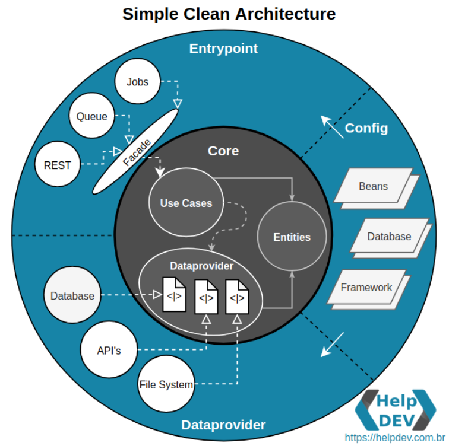

## Implementação de Clean Architecture com Spring Boot e Java
Este projeto é uma implementação de uma aplicação de exemplo utilizando a arquitetura 
Clean Architecture com Spring Boot e Java de forma simplificada.

### Diagrama

O negócio fica protegido na camada core com domain, usecases e dataprovider. Neste momento, os usecases utilizam apenas interfaces do dataprovider para executar a lógica.
As implementações de dataproviders ficam no pacote dataprovider fora do core. A função dos dataproviders é fornecer acesso a dados, seja de um banco de dados, um serviço REST, um serviço SOAP, um arquivo, etc.
Na camada de entrypoint, temos os controllers e os consumidores de eventos que são responsáveis por receber os eventos e chamar os usecases(interfaces).
O pacote config contém as configurações do Spring Boot e dos Beans, uma vez não temos frameworks e libs no core.

### Fluxo da aplicação

### Tecnologias
- Java 17
- Spring Boot 3
- Lombok
- Mapstruct
- MongoDB
- Docker
- Kafka
- Wiremock